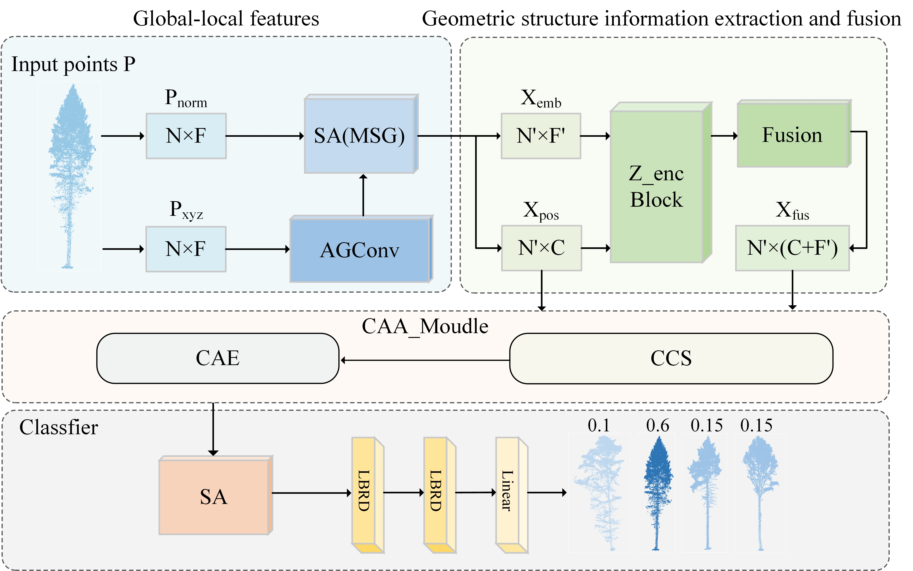

# Deep Point Feature Aggregation Network for Classification of Irregular Objects in UAV LIDAR Point Clouds

## Description


<div align="center">
<br><br>
</div>


## Classification (ModelNet40/TreeNet)
### Data Preparation
Download alignment **ModelNet** [here](https://shapenet.cs.stanford.edu/media/modelnet40_normal_resampled.zip) and save in `data/modelnet40_normal_resampled/`.

### Data Preparation


### Run

```
python train.py --model DPFANet --log_dir DPFANet_log --use_normals --process_data
```

* --model: model name
* --log_dir: path to log dir
* --use_normals: use normals
* --process_data: save data offline

## Test

```
python test.py --log_dir DPFANet_log --use_normals
```

## Performance

### Test on ModelNet40

| Model | Mean Accuracy |
|--|--|
| PointNet (Official) | 86.2 |
| DeepGCN             | 90.3          |
| LCPFormer | 90.4          |
| DPFANet | 91.4          |

### Test on TreeNet

| Model                 | Mean Accuracy |
| --------------------- | ------------- |
| PointNet (Official)   | 81.37         |
| PointNet ++(Official) | 84.05         |
| PT1                   | 85.17         |
| DPFANet               | 88.00         |

## Citation

Please cite our paper if you find it useful in your research:

```

```

## Contact
If you have any questions, please contact zhang@nefu.edu.cn
